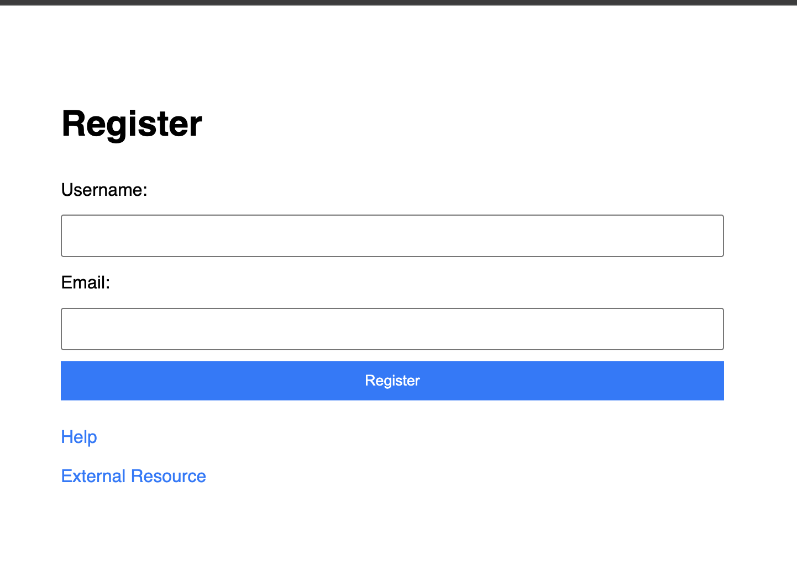

<h1>
  <span class="headline">Pre-Selenium: CSS Selectors and Attributes</span>
  <span class="subhead">HTML Attributes in Selectors</span>
</h1>

**Learning objective:** Apply attribute selectors to locate elements based on HTML attributes such as `type`, `name`, or `href`.

## Introduction to HTML attributes and why they matter for selectors

When working with HTML in the browser, _attributes_ are additional pieces of information attached to elements. These attributes can describe an element’s type, its destination, its role in a form, or even store custom data for your own scripts. Some attributes, like `href` for links or `type` for inputs, are required. Others are optional or even custom-named.

For example:

```html
<input type="email" name="user_email" />
<a href="https://example.com">Visit Site</a>
```

When automating browser actions with Selenium, relying only on tag names, classes, or IDs may not always locate the element you want—especially on complex or dynamic web pages. HTML attributes give you extra power and precision, letting you communicate with the browser in a way that’s a bit like giving it a full address, not just a street name.

> 💡 If you have ever searched for a specific item in a spreadsheet using both the column header and the value (such as "every row where Status is Complete"), you have already used an idea similar to attribute selectors in CSS.

As a Python developer, you may think in terms of _key-value pairs_ or _dictionaries_. HTML attributes work similarly: they attach specific keys (like `name`, `type`, or `href`) and their corresponding values to elements. By using CSS selectors that target these attribute-value pairs, you can write Selenium tests that are robust, even when the page’s structure, style, or class names change.

## Understanding attribute selector syntax

Attribute selectors let you match elements using the information in their attributes. This approach goes beyond the basic selectors covered previously, adding a layer of flexibility and control.

Here’s the syntax:

- `[attribute]`: Selects any element with the attribute, regardless of value.
- `[attribute="value"]`: Selects elements where the attribute’s value exactly matches.
- You can combine these selectors with tag, class, or ID selectors for greater specificity.

Let’s put this into practice:

### Example: Targeting by attribute only

```css
input[type]
```

Selects all `<input>` elements that have a _type_ attribute, no matter its value.

### Example: Targeting by exact attribute value

```css
input[type="email"]
```

Selects all `<input>` elements with a _type_ exactly set to "email".

> 🏆 Best practice: Attribute selectors can be combined with other selector types. For example, `button.primary[type="submit"]` targets a submit button with the class "primary"—making your browser automation scripts more precise and less fragile.

> 📚 An _attribute selector_ is a CSS selector pattern that targets elements based on one or more attribute name and value combinations.

## Using common attributes in test automation

In test automation, some attributes are especially helpful for targeting the right element, such as in forms, links, and buttons. Here are some of the most useful:

| Attribute | Common Use                                                | Example Selectors                                                                |
| --------- | --------------------------------------------------------- | -------------------------------------------------------------------------------- |
| `type`    | Used on `<input>`, `<button>`, and other form elements    | `input[type="text"]` (text fields) <br> `button[type="submit"]` (submit buttons) |
| `name`    | Often unique within a form; useful for targeting inputs   | `input[name="email"]` <br> `input[name="search"]`                                |
| `href`    | Specifies destination URL on `<a>` elements               | `a[href^="http"]` (external links) <br> `a[href="/signup"]`                      |
| `value`   | Identifies buttons by displayed value                     | `input[type="submit"][value="Search"]`                                           |
| `data-*`  | Developer-defined custom attributes for tracking/metadata | `[data-analytics="click"]`                                                       |

**Here’s an example HTML snippet you might encounter in a web project:**

 

<br>

```html
<form>
  <input type="text" name="username" />
  <input type="email" name="user_email" />
  <button type="submit">Register</button>
</form>
<a href="/help" class="nav-link">Help</a>
<a href="https://external.com" target="_blank">External Resource</a>
```

Sample selectors for these elements:

- Select the email input field: `input[name="user_email"]`
- Select the Register button: `button[type="submit"]`
- Select all external links: `a[href^="http"]`

> 💡 By targeting specific attributes and values, you reduce the risk of selecting the wrong element—especially in interfaces where class names or IDs are missing, reused, or generated dynamically.

## Partial attribute matching: contains, starts with, and ends with

Web pages sometimes use dynamically generated class names or IDs, or you might need to select elements by patterns rather than exact matches. CSS attribute selectors offer special operators to match attribute values partially:

- `[attribute*="value"]`: Contains  
  Selects elements where the attribute value contains "value" anywhere.
- `[attribute^="value"]`: Starts with  
  Selects elements where the attribute value starts with "value".
- `[attribute$="value"]`: Ends with  
  Selects elements where the attribute value ends with "value".

Here’s how these work in practice:

### Contains example

```css
a[href*="signup"]
```

Matches all links containing "signup" anywhere in their `href`, such as `/users/signup`, `/signup-offer`, or `/app/signup/complete`.

### Starts with example

```css
input[name^="user"]
```

Matches inputs whose `name` attribute begins with "user", such as `user_email`, `user_id`, or `user_country`.

### Ends with example

```css
img[src$=".png"]
```

Finds all images ending with the `.png` file extension.

> 🧠 When working with web apps that generate unique values for element attributes (like `name01`, `name02`, etc.), partial match selectors are invaluable for targeting whole categories of elements at once.

<div class="activity guided-walkthrough">
  <h2 class="title">Selecting Form Inputs, Links, and Data Attributes</h2>
  <span class="minutes">5 min</span>
</div>

This activity gives you hands-on practice using **CSS attribute selectors** to target HTML elements for automation. You'll write, test, and analyze selectors using real HTML examples and Chrome DevTools—just like you'll do when writing Selenium tests.

### Use This Sample HTML

Copy and paste the following HTML into a local `.html` file in your project folder, then open it in Chrome.

```html
<form>
  <input type="text" name="user_email" placeholder="Email" />
  <input type="password" name="user_password" placeholder="Password" />
  <button type="submit" value="Register">Register</button>
</form>

<a href="/help" class="nav-link">Need Help?</a>
<a
  href="https://example.com/pricing"
  class="external"
  data-analytics="promo-click"
>
  View Pricing
</a>
```

### Explore the HTML in DevTools

1. **Open the page in Chrome**  
   Right-click the page and select **Inspect** to open DevTools.

2. **Switch to the _Elements_ tab**  
   Browse the structure and identify:

   - Form fields with `type`, `name`, or `value`
   - Links with `href`
   - Any custom `data-*` attributes

3. **Open the Find bar in DevTools**
   - Press <kbd>Ctrl</kbd> + <kbd>F</kbd> (Windows/Linux) or <kbd>Cmd</kbd> + <kbd>F</kbd> (Mac)
   - Use this bar to enter **CSS selectors** and highlight matching elements in the DOM

### Try These Selectors

Enter a few of the selectors below in the Find bar to see them in action:

| Selector                         | What It Matches                                |
| -------------------------------- | ---------------------------------------------- |
| `input`                          | All input fields                               |
| `input[name="user_email"]`       | The email field                                |
| `input[type="password"]`         | The password field                             |
| `button[value="Register"]`       | The Register button                            |
| `a[href^="http"]`                | Links to external sites (starting with `http`) |
| `a[href*="pricing"]`             | Any link with "pricing" in the URL             |
| `[data-analytics]`               | Any element with a `data-analytics` attribute  |
| `[data-analytics="promo-click"]` | Elements tracked specifically for promo clicks |
| `a.external[data-analytics]`     | External links that are tracked for analytics  |
| `input[name$="email"]`           | Input fields where the name ends in "email"    |

> 💡 As you enter each selector, matching elements will be highlighted in the DOM view.

### Experiment

- **Observe what matches** each selector and why.
- Try **editing attribute values directly** in the Elements panel and re-run your selectors to see how the match results change.
- Consider: What makes a selector **more reliable** or **less brittle** in a real-world automation test?

<div class="activity discussion">
  <h2 class="title">Reflect</h2>
  <span class="minutes">2 min</span>
</div>

How did attribute selectors help you be more precise in targeting elements compared to class or ID selectors? Was there a situation where combining attribute selectors with class or element selectors improved accuracy?

## Knowledge check

❓ Which selector would match all elements with a `data-analytics` attribute that starts with the word "promo"?

- A. `[data-analytics="promo"]`
- B. `[data-analytics^="promo"]`
- C. `[data-analytics*="promo"]`
- D. `[data-analytics$="promo"]`

❓ What will the selector `input[name$="password"]` match?

- A. All input fields with any name attribute
- B. Input fields whose name starts with "password"
- C. Input fields whose name contains "password" anywhere
- D. Input fields whose name ends with "password"
