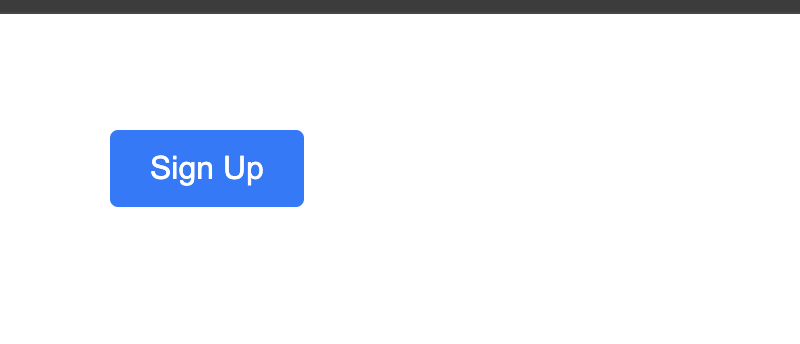

<h1>
  <span class="headline">Pre-Selenium: CSS Selectors and Attributes</span>
  <span class="subhead">Mastering Basic CSS Selectors</span>
</h1>

**Learning Objective:** Identify and use basic CSS selectors including element, class, and ID selectors.

## Overview of CSS selectors in test automation

When automating browser actions with tools such as Selenium, you need a reliable way to find and interact with specific pieces of a web page. CSS selectors are like addresses for these elements. While CSS selectors are often used for styling, in this context, you'll use them for test automation: clicking buttons, filling forms, or reading text.

You can think of CSS selectors as your set of instructions to tell a browser or tool, “work with only these parts of the page!” Mastering selectors makes your automation scripts more reliable and easier to read—even as the web page around them changes.

> 💡 Mastering CSS selectors is not just a technical exercise—it is an essential part of “speaking the language of the browser,” enabling you to direct browser actions precisely and confidently.

## Element selectors: How to target HTML tags directly

**Element selectors** are the simplest kind of CSS selectors. They let you select every element of a certain type or _tag_. For instance, if you want to work with every `<button>` or `<input>` element on a page, element selectors are your tool of choice.

Write the name of the HTML tag by itself as your selector.

```css
button
input
div
p
```

- `button` selects all button elements.
- `input` grabs every input field.
- `div` finds all division containers.
- `p` finds all paragraphs.

**When to use:**

Element selectors are helpful when you want to work with every item of a specific type, such as checking all checkboxes on a settings page or verifying that all images load on an e-commerce site.

> ⚠ Because element selectors are broad, they may sometimes select more elements than you intend. Using selectors that are too broad can make your tests fragile if the page changes. For better precision, consider more specific selectors as reviewed below.

## Class selectors: Using `.` to select elements by class

In HTML, the _class_ attribute groups elements that share a role, style, or behavior. Elements can share classes, and class selectors let you target all elements carrying a specific class value.

You create a class selector by writing a dot (`.`) followed by the class name.

```css
.button .active .form-input;
```

- `.button` selects all elements with the class “button”
- `.active` selects all elements with the class “active”
- `.form-input` selects all with the class “form-input”

You can also combine a tag and a class to narrow your search:

```css
button.primary
```

This target finds all `<button>` tags that have the class “primary.”

### Real-world example

Suppose you’re working with this button:

```html
<button class="btn signup-btn">Sign Up</button>
```

- `.signup-btn` will match this button (and any others with the same class).
- `button.signup-btn` matches only `<button>` elements tagged “signup-btn.”



<br>

**When to use:**

Use class selectors when you want to group and interact with elements sharing a role, such as all “error” messages or all menu links.

> 🏆 Best Practice: Classes often signal an intent or function shared across elements. Combining the tag name and class makes your selectors more robust and less likely to break as page content evolves.

## ID selectors: Using `#` to select unique elements

The _id_ attribute is meant to uniquely identify an element on a page. ID selectors provide the highest precision and are best used when you want to interact with a one-of-a-kind item—such as a search bar, a submit button, or a headline.

You create an ID selector by writing a hash (`#`) followed by the id value.

```css
#submit-btn #nav #email-field;
```

- `#submit-btn` matches `<button id="submit-btn">Submit</button>`
- `#email-field` matches `<input id="email-field" />` and nothing else

For even greater precision, you can combine with the element type:

```css
input#email-field
```

This selector grabs only the `<input>` element with the id “email-field.”

> 🏆 Best Practice: Since IDs should be unique, using an ID selector gives you reliability. Avoid applying the same ID to multiple elements. For items that can be repeated (like product images), use classes instead.

**Why this matters for Selenium:**

Selenium’s `find_element_by_id` (or similar functions) follow the same principle. Sometimes, using a CSS selector with `#` gives you extra flexibility—especially when chaining selectors or writing more complex queries for dynamic pages.

<div class="activity guided-walkthrough">
  <h2 class="title">Writing and testing basic selectors in Chrome DevTools</h2>
  <span class="minutes">5 min</span>
</div>

It’s time to move from theory to practice. You will use Chrome’s DevTools to experiment with CSS selectors and see the results instantly—no guesswork, just immediate feedback.

**Why DevTools?**
DevTools lets you test selectors in real-time—just as Selenium does, but without writing an entire script.

### Getting started

1. Open any page in your browser.
2. Open DevTools:
   - **Windows/Linux:** <kbd>Ctrl</kbd> + <kbd>Shift</kbd> + <kbd>I</kbd>
   - **Mac:** <kbd>Cmd</kbd> + <kbd>Option</kbd> + <kbd>I</kbd>
3. Go to the **Elements** panel.
4. Press <kbd>Ctrl</kbd> + <kbd>F</kbd> (Windows/Linux) or <kbd>Cmd</kbd> + <kbd>F</kbd> (Mac) to bring up the Find bar.

You can now type CSS selectors and see matching elements highlighted right in the code.

#### Example HTML snippet for practice

Copy and paste this into a new HTML file or experiment with any public page.

```html
<!DOCTYPE html>
<html>
  <body>
    <button class="action primary">Save</button>
    <button class="action secondary">Cancel</button>
    <input
      id="search-bar"
      class="input-field"
      type="text"
      placeholder="Search..."
    />
    <div class="alert error">There was an error processing your request.</div>
    <div class="alert success">Signup successful!</div>
  </body>
</html>
```

**Selectors to try in DevTools:**

- `button` — selects all buttons.
- `.action` — matches the Save and Cancel buttons.
- `button.primary` — targets only the “Save” button.
- `.alert` — both status messages, or `.alert.error` for just the error.
- `#search-bar` — selects the search input.

> 💡 Notice how specificity increases as you combine tag, class, and ID selectors.

## Knowledge check

❓ Which of the following selectors would _only_ match a single element, if the page follows HTML best practices?

- A. `.action`
- B. `button.primary`
- C. `#submit-btn`
- D. `div`
