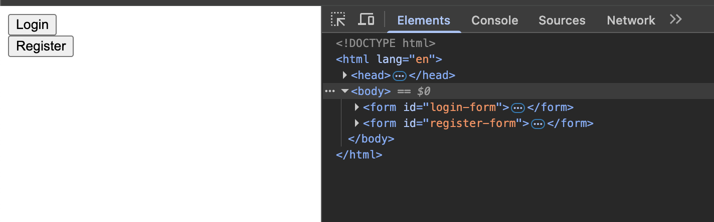
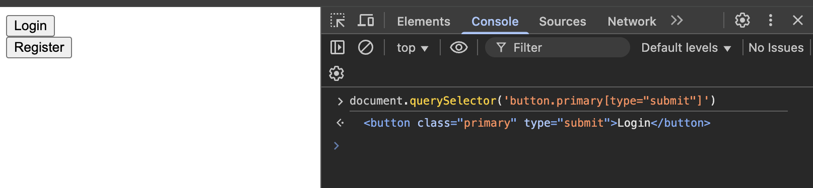

<h1>
  <span class="headline">Pre-Selenium: CSS Selectors and Attributes</span>
  <span class="subhead">Selector Testing and Refinement with DevTools</span>
</h1>

**Learning Objective:** Test CSS selectors in the browser using Chrome DevTools to validate that the correct element is targeted.

## Chrome DevTools for effective selector testing

When automating browser actions using Selenium, crafting the correct CSS selector is essential—but the real challenge lies in making sure that selector reliably finds the right element on a live web page.

DevTools reveals the “behind the scenes” structure of any web page. It allows you to:

- Inspect and understand the full HTML of the page.
- See every tag and attribute in a digestible tree view.
- Test selectors and instantly preview which elements are matched.

> 💡 Using DevTools lets you spot errors or ambiguities in your selectors before they affect your automation script, saving you troubleshooting time and helping you write more reliable UI tests.

## Elements panel to inspect and understand page structure

To begin, open DevTools on any web page. Right-click an element (such as a button or input field) and choose **Inspect**. This opens the **Elements** panel—a visual map of the website’s Document Object Model (DOM).

**Distinguishing similar elements**

Suppose you have two “Submit” buttons for login and registration:

```html
<form id="login-form">
  <button class="primary" type="submit">Login</button>
</form>
<form id="register-form">
  <button class="primary" type="submit">Register</button>
</form>
```

By expanding each `<form>` in DevTools, you can see exactly where each button “lives”, which attributes make them unique, and how to distinguish them in your selectors.



> 💡 Use the blue highlighting feature: When you select a node in DevTools, the element’s location on the page is clearly marked, bridging what you see in code and the user interface.

## Using the Console with `document.querySelector()` for live tests

Apart from the visual search in the Elements panel, DevTools includes a powerful Console—a JavaScript command line inside your browser. Here, you can write and test selectors using the `document.querySelector()` and `document.querySelectorAll()` methods.

- `document.querySelector('your_selector')` returns the first matching element or `null`.
- `document.querySelectorAll('your_selector')` returns all matching elements as a NodeList.

**Example in context:**

```javascript
document.querySelector('button.primary[type="submit"]');
// Returns: <button class="primary" type="submit">Login</button> (if that is the first match)
```

```javascript
document.querySelectorAll('form button');
// Returns: NodeList containing both buttons from both forms
```



> 🧠 The Console lets you experiment with selectors just as Selenium will. If your selector works here, it will work in your Selenium scripts, too.

**Why use the Console?**

- **Immediate Feedback:** Instantly see what your selector captures—helping you iterate rapidly.
- **Debugging:** Catch mistakes before they make it into your Python code.
- **Refinement:** Edit your selector and immediately see how the results change.

## Refining selectors to ensure uniqueness and reliability

A robust selector must find the target element every time, even as the page structure changes. Testing selectors in DevTools allows you to fine-tune for uniqueness and avoid common pitfalls.

- **Too broad:** Selector matches more elements than intended (for example, all buttons on the page).
- **Too narrow or incorrect:** Selector matches nothing—perhaps due to a typo or wrong attribute.
- **Ambiguity:** Selector’s result changes based on subtle page changes, which might cause tests to be unreliable.

**Strategies for more reliable selectors:**

- Use **compound selectors**: Combine element, class, and attribute for greater specificity.  
  Example: `button.primary[type="submit"]`
- Apply **descendant or parent-child selectors**: Add context by targeting elements inside specific containers.  
  Example: `#register-form button.primary`
- Leverage **unique attributes**: Whenever possible, use unique IDs or data attributes.
- Try **partial attribute selectors**: Useful for elements with dynamically generated names.  
  Example: `[id^="login-"]` for IDs starting with “login-”.

## Best practices for maintaining and optimizing selectors in test automation

In any real-world automation project, selectors need to be both accurate and sustainable. Overly fragile selectors can break your tests as the website changes. Apply these guidelines to keep your selectors reliable:

| Best Practice                     | Why It Matters                                                                                                 |
| --------------------------------- | -------------------------------------------------------------------------------------------------------------- |
| **Prefer stable attributes**      | Choose attributes less likely to change, such as `data-*` or unique IDs, rather than appearance-based classes. |
| **Avoid dynamic values**          | IDs or classes that change with each page load (like `btn-9823`) are unreliable.                               |
| **Combine selectors for context** | Use compound selectors with **parent-child relationships** to avoid accidental matches.                        |
| **Always test in DevTools**       | If a selector fails here, it will fail in your Selenium scripts.                                               |
| **Document intent**               | Leave **comments** in your code indicating what each selector is for and how it was crafted.                   |

> 🏆 The best selectors are clear, robust, and easy to understand—making both your code and your testing process more dependable.
